#版本一   页面效果（页面写的一般见谅！）  

##一、注册  

###步骤一  

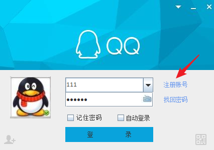
###步骤二  

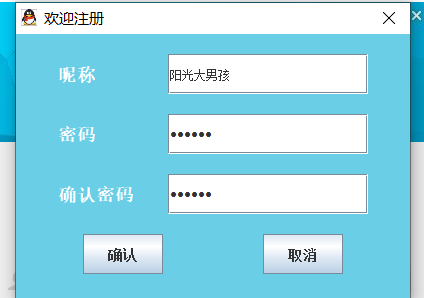
###步骤三  

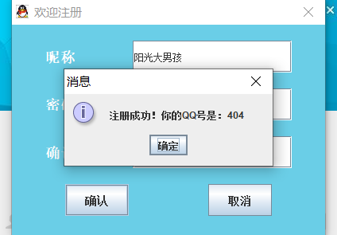
##二、登录  

###登录界面  

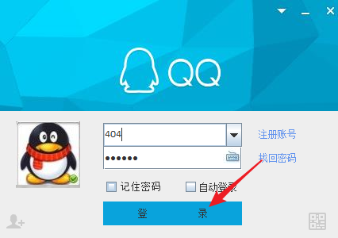
###主界面  

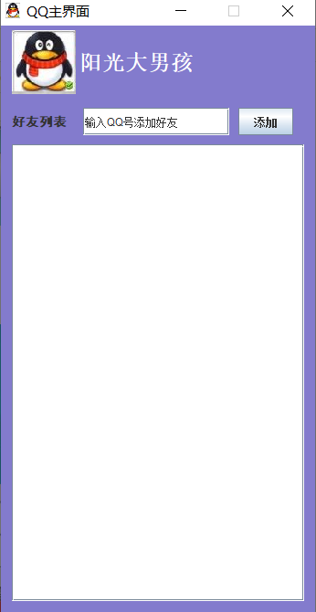
##三、添加好友  

###再注册登录一个用户  

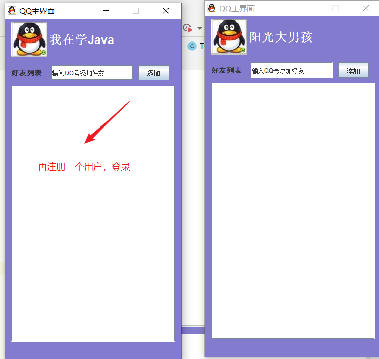
###输入QQ添加好友  

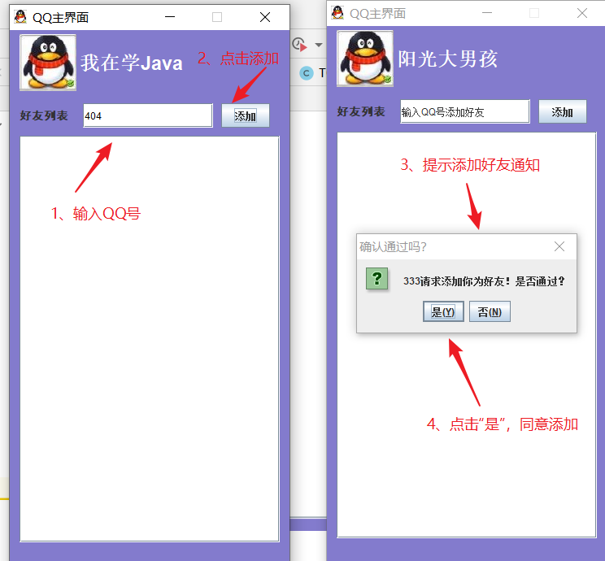
###确认后刷新好友列表界面  

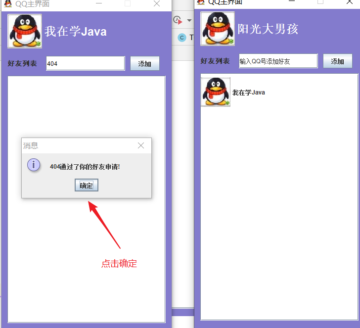
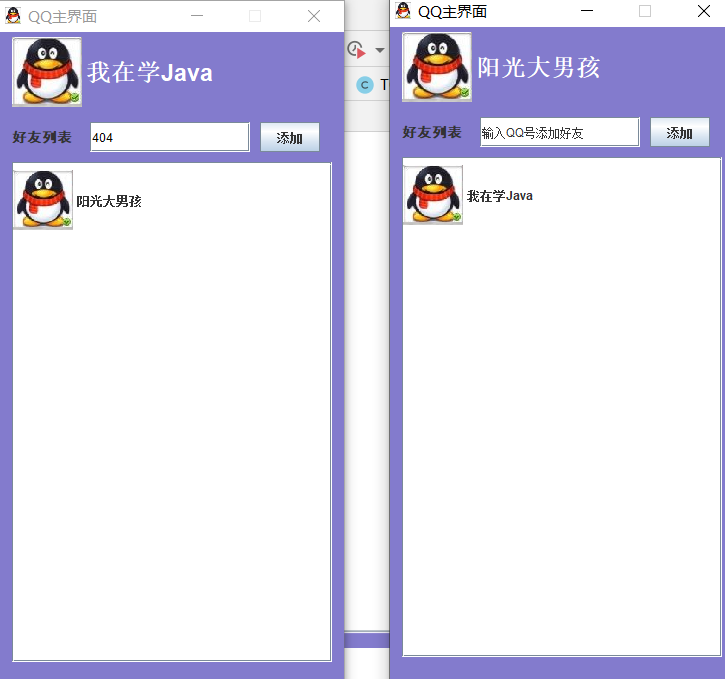
##四、发送消息（只是实现了在线聊天，离线消息未实现）  

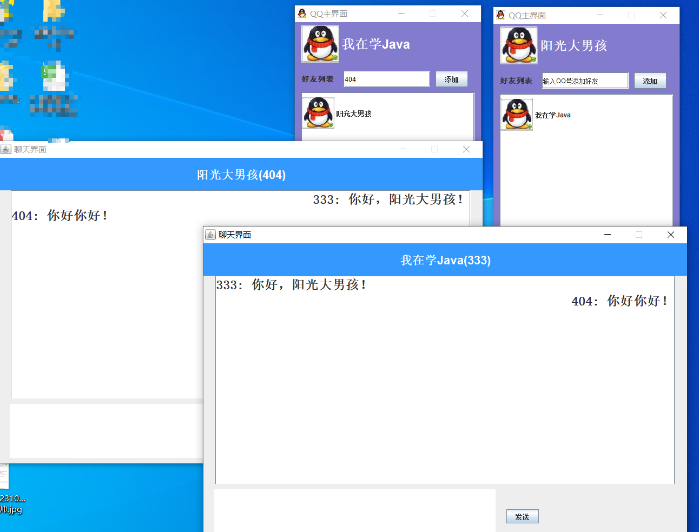
###对方下线，再发送消息会提示“对方不在线”  

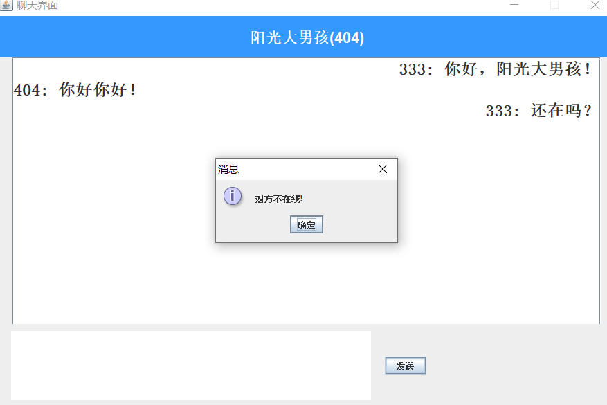
##五、数据库SQL  

用户表

create table `user`(
`account` varchar(10) not null primary key,
`name` varchar(30) not null,
`password` varchar(30) not null
)ENGINE=INNODB CHARSET=UTF8 COLLATE=UFT8_GENERAL_CI;

好友关系表

create table `friend`(
`me` varchar(10) not null,
`friend` varchar(10) not null
)ENGINE=INNODB CHARSET=UTF8 COLLATE=UTF8_GENERAL_cI;